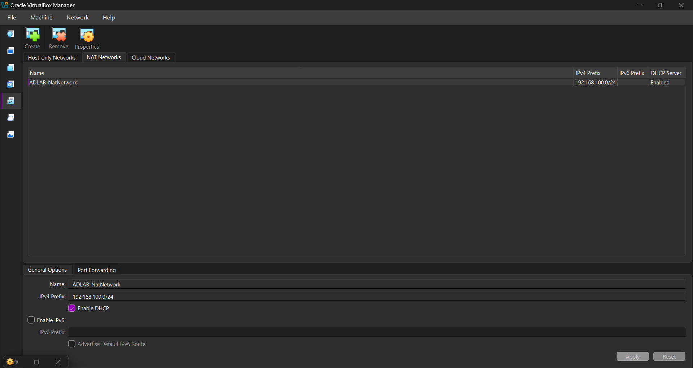
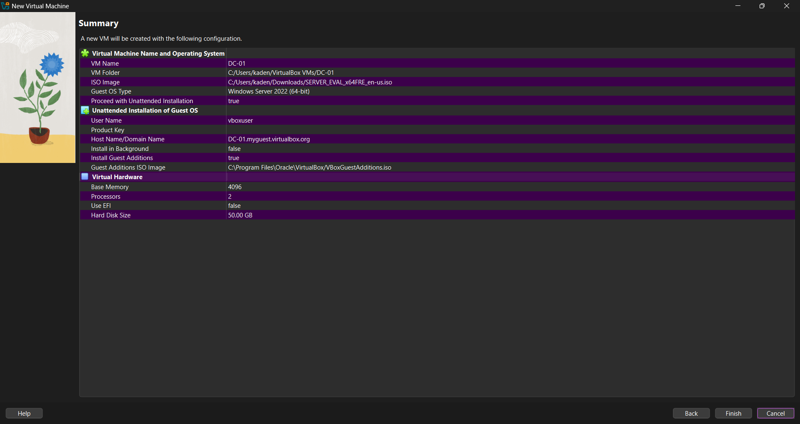
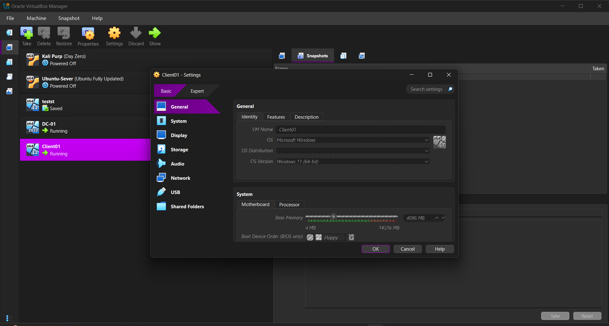
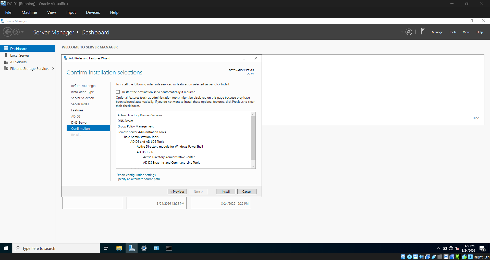
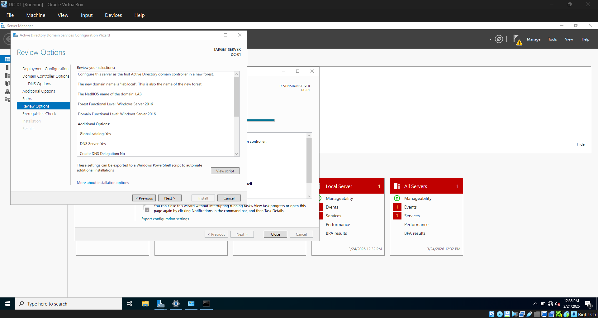
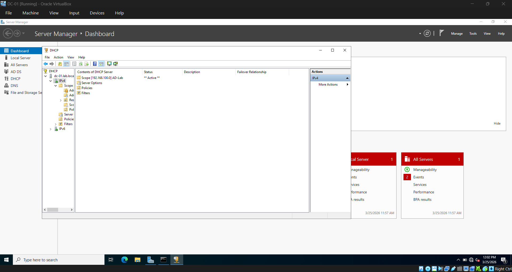
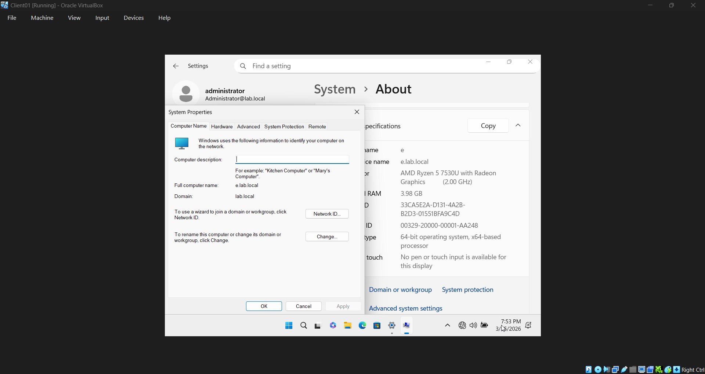

# 01 — Environment Setup

## Host Machine
- **OS:** Windows 11
- **RAM:** 16GB
- **Hypervisor:** VirtualBox

## ISOs Used
- [Windows Server 2022 Evaluation](https://www.microsoft.com/en-us/evalcenter/evaluate-windows-server-2022)
- [Windows 11 Enterprise Evaluation](https://www.microsoft.com/en-us/evalcenter/evaluate-windows-11-enterprise)

## Network Configuration
- **Network type:** NAT Network
- **Name:** AD-Lab
- **Subnet:** 192.168.100.0/24
- **DHCP range:** 192.168.100.20 — 192.168.100.100

## Virtual Machines

### DC01 — Domain Controller
- **OS:** Windows Server 2022 Standard Evaluation (Desktop Experience)
- **RAM:** 4096MB
- **CPU:** 2 cores
- **Storage:** 50GB
- **IP:** 192.168.100.10 (static)

### CLIENT01 — Domain Client
- **OS:** Windows 11 Enterprise Evaluation
- **RAM:** 4096MB
- **CPU:** 2 cores
- **Storage:** 50GB
- **IP:** Assigned by DHCP

## Steps Taken

### 1. Created NAT Network
Created an internal NAT Network in VirtualBox to allow VMs to communicate
with each other while staying isolated from the host network.

### 2. Built DC01 and installed Windows Server 2022
Created the DC01 VM and installed Windows Server 2022. Set a static IP of
192.168.100.10 so the client can always locate the DC.

### 3. Installed AD DS, DNS, and DHCP roles
Added the AD DS, DNS, and DHCP server roles via Server Manager then promoted
DC01 to a domain controller creating a new forest — lab.local.

### 4. Configured DHCP Scope
Created a DHCP scope (AD-Lab) to automatically assign IPs in the range
192.168.100.20 — 192.168.100.100 to domain-joined machines.

### 5. Built CLIENT01 and joined to domain
Created the CLIENT01 VM, installed Windows 11 Enterprise, and joined it to
lab.local. Had to manually set DNS to 192.168.100.10 before the domain
could be found — lab.local is not a public domain so the client needs to
point DNS at the DC directly.

## Issues Encountered

CLIENT01 could not find lab.local during domain join. Manually set DNS to DC IP (192.168.100.10) — client was querying public DNS, which has no record of lab.local 

## Result
Both VMs are running, and CLIENT01 is successfully domain-joined to lab.local.
