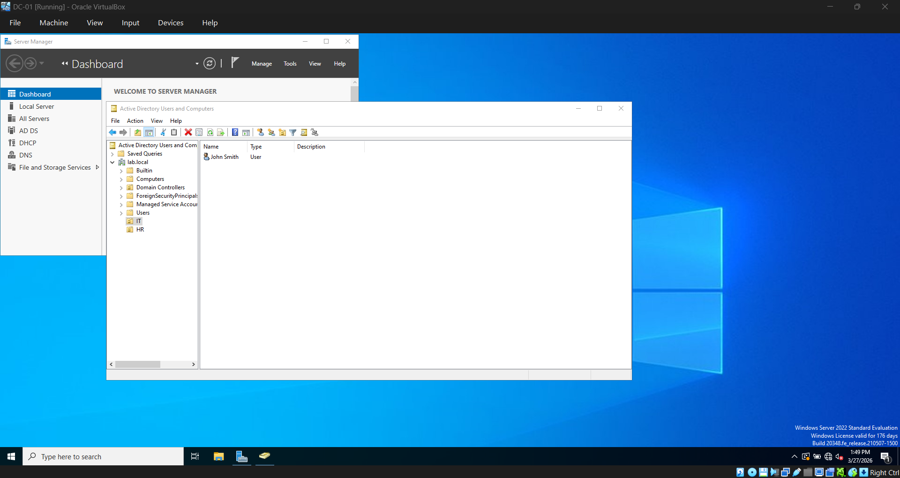
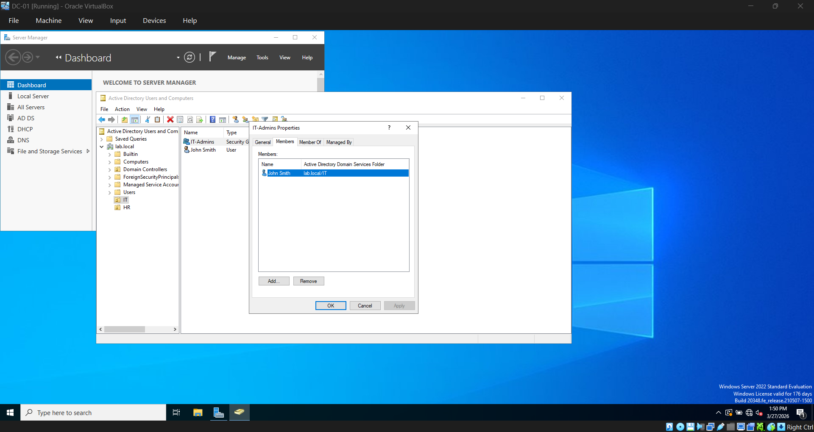
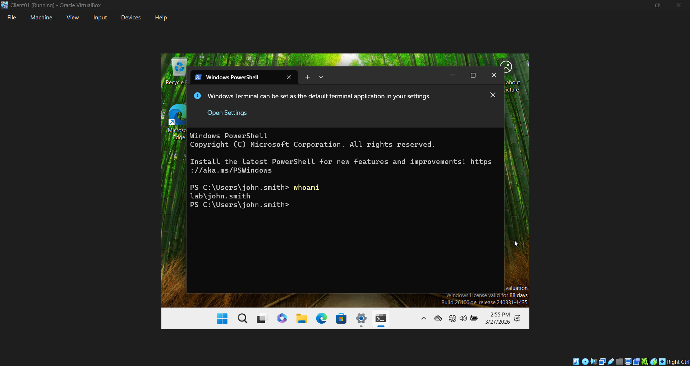

# 02 — Active Directory Domain Services

## Overview
Configured the Active Directory structure for lab.local, including
Organizational Units, domain users, and security groups.

## Organizational Units Created
- **IT** — Contains IT department users and computers
- **HR** — Contains HR department users and computers
- **Computers** — Contains domain-joined computer accounts

## Users Created
- **john.smith** — IT OU — IT Admin
- **jane.doe** — HR OU — HR Staff

## Security Groups Created
- **IT-Admins** — Global Security Group — Members: john.smith

## Steps Taken

### 1. Created Organizational Units
Created IT and HR OUs under lab.local to organize users by department.
The default Computers container was left in place for computer accounts.

### 2. Created Domain Users
Created two test users and placed them in their respective OUs.
Password never expires was enabled for lab purposes.

### 3. Created Security Group
Created IT-Admins security group in the IT OU and added john.smith
as a member. Security groups allow permissions to be assigned to
multiple users at once rather than individually.

### 4. Verified Domain Login
Successfully logged into CLIENT01 using john.smith domain credentials.
Confirmed with whoami command showing lab\john.smith.

## Issues Encountered
None.

## Result
AD structure is in place with OUs, users, and security groups configured.
Domain login verified on CLIENT01.
