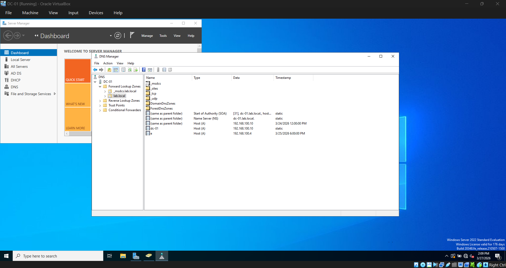
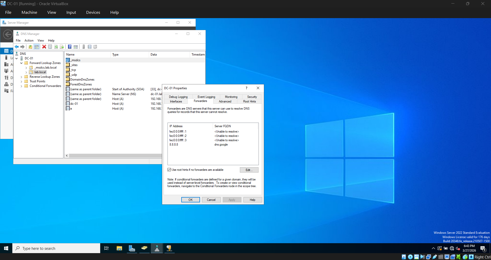
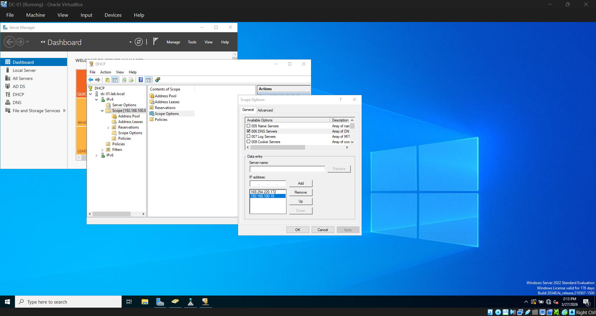
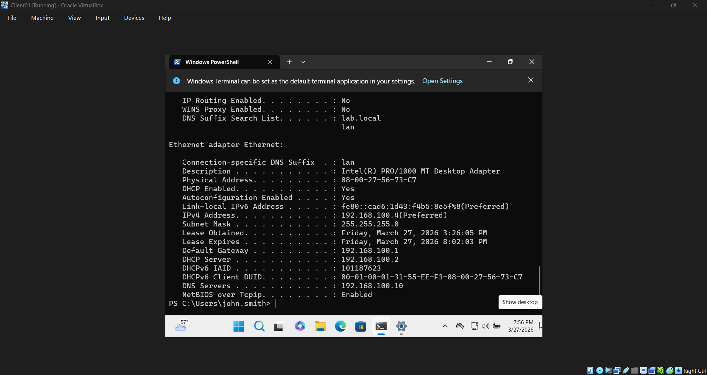

# 03 — DNS & DHCP

## Overview
Verified DNS configuration for lab.local and configured DHCP scope options
to automatically assign the correct DNS server to domain joined machines.
Also configured DNS forwarding for external internet resolution.

## DNS Configuration

### Forward Lookup Zone
Verified the lab.local forward lookup zone was automatically created
during domain promotion. Both DC01 and CLIENT01 have A records registered.

- **DC01** — 192.168.100.10 (static)
- **E (CLIENT01)** — 192.168.100.4 (dynamic, registered on domain join)

### DNS Forwarder
Configured a DNS forwarder to 8.8.8.8 so the DC can resolve external
internet addresses. Without this CLIENT01 could ping IPs directly but
could not resolve domain names like google.com.

## DHCP Configuration

### Scope Options
Configured the following scope options so all machines that receive
a DHCP lease automatically get the correct network settings.

- **003 Router** — 192.168.100.1
- **006 DNS Server** — 192.168.100.10

### Verification
Ran ipconfig /release and ipconfig /renew on CLIENT01 to confirm
it received the correct IP and DNS settings from DHCP.

## Issues Encountered
- **CLIENT01 could not resolve external domain names** — DC's DNS had no
forwarder configured so external queries failed. Fixed by adding 8.8.8.8
as a forwarder in the DNS console.

## Result
DNS is resolving both internal (lab.local) and external (google.com)
addresses correctly. DHCP is automatically handing out the correct
DNS server and gateway to all machines on the network.
