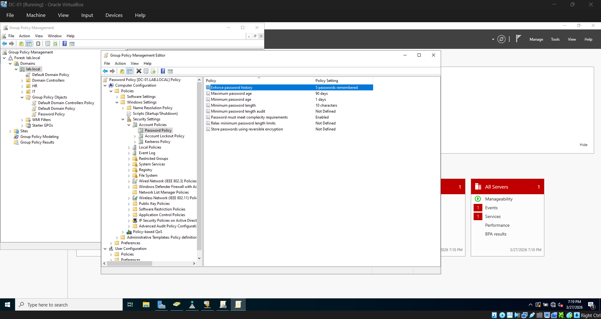
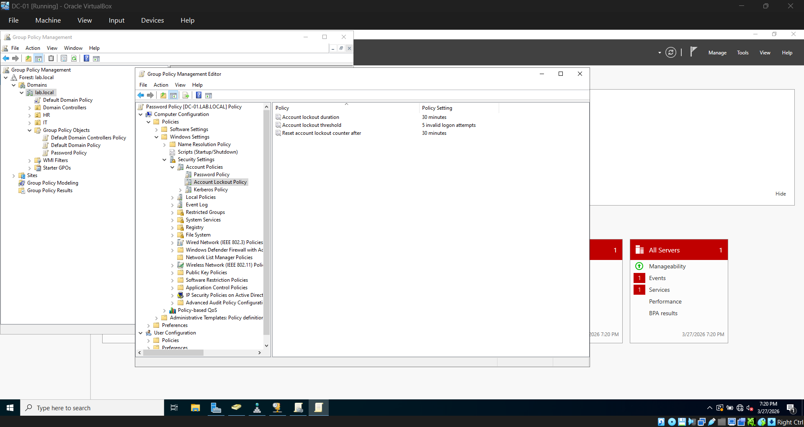
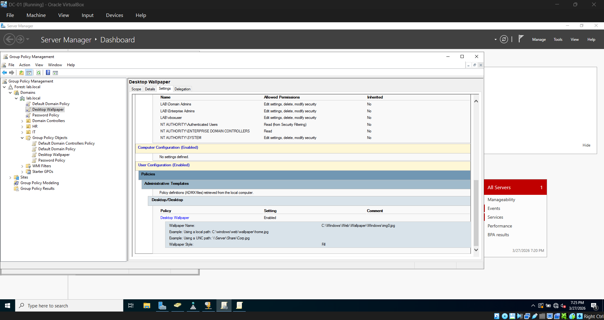
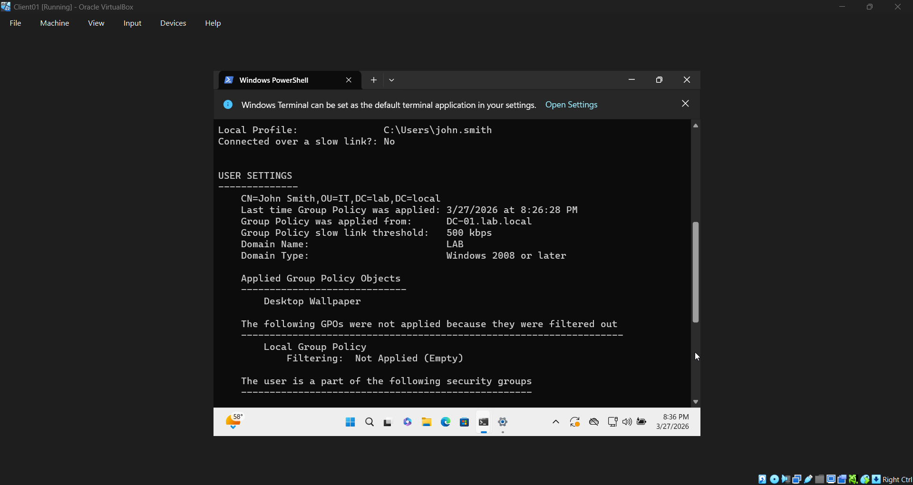
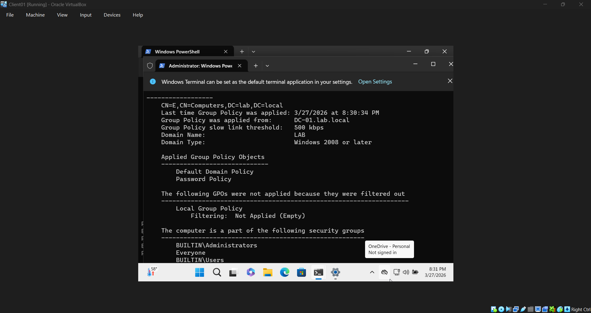

# 04 — Group Policy

## Overview
Created and linked Group Policy Objects to enforce security settings
and user configurations across the lab.local domain.

## GPOs Created

### Password Policy
Linked to: lab.local
Type: Computer Configuration

Settings configured:
- Minimum password length — 10 characters
- Password must meet complexity requirements — Enabled
- Maximum password age — 90 days
- Minimum password age — 1 day
- Enforce password history — 5 passwords remembered
- Account lockout threshold — 5 invalid logon attempts
- Account lockout duration — 30 minutes
- Reset account lockout counter after — 30 minutes

### Desktop Wallpaper
Linked to: lab.local
Type: User Configuration

Settings configured:
- Wallpaper path — C:\Windows\Web\Wallpaper\Windows\img0.jpg
- Wallpaper style — Fill

## GPOs Linked to Domain

Both GPOs are linked at the domain level so they apply to all
users and computers in lab.local.

## Verification

Ran gpupdate /force on CLIENT01 to pull the latest policies from the DC.
Logged in as john.smith and confirmed the wallpaper GPO applied.
Ran gpresult /r /scope computer as Administrator to confirm both
GPOs are listed as applied.

## Issues Encountered
- **gpresult /r /scope computer returned access denied** — command needs
to be run as Administrator. Relaunched Command Prompt as Administrator
and ran successfully.

## Result
Both GPOs are confirmed applying to CLIENT01. Password and lockout
policies are enforced domain wide and desktop wallpaper is pushed
to all domain users.
