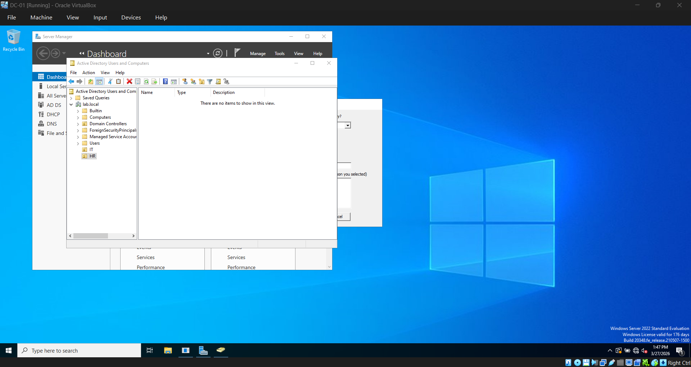

# 05 — Users & Groups

## Overview
Created Organizational Units, domain user accounts, and security groups
to simulate a basic enterprise Active Directory structure.

## Organizational Unit Structure
- **IT** — Contains IT department user accounts
- **HR** — Contains HR department user accounts
- **Computers** — Default container for domain joined computers

## Users Created

### john.smith
- **Full name:** John Smith
- **OU:** IT
- **Member of:** IT-Admins
- **Purpose:** Simulates an IT department employee

### jane.doe
- **Full name:** Jane Doe
- **OU:** HR
- **Purpose:** Simulates an HR department employee

## Security Groups Created

### IT-Admins
- **Group scope:** Global
- **Group type:** Security
- **OU:** IT
- **Members:** john.smith
- **Purpose:** Group for IT administrative accounts

## Steps Taken

### 1. Created Organizational Units
Created IT and HR OUs under lab.local to organize users by department
mirroring how a real enterprise environment would be structured.

### 2. Created Domain Users
Created john.smith in the IT OU and jane.doe in the HR OU.
Password never expires was enabled for lab purposes only — in a real
environment this would not be set.

### 3. Created Security Group
Created IT-Admins global security group in the IT OU and added
john.smith as a member. Security groups allow permissions and policies
to be assigned to multiple users at once.

### 4. Verified Domain Login
Successfully logged into CLIENT01 using john.smith domain credentials.
Confirmed correct account with whoami showing lab\john.smith.

## Issues Encountered
None.

## Result
OU structure, domain users, and security groups are in place and
functioning correctly. Domain login verified on CLIENT01 using
a standard domain user account.
